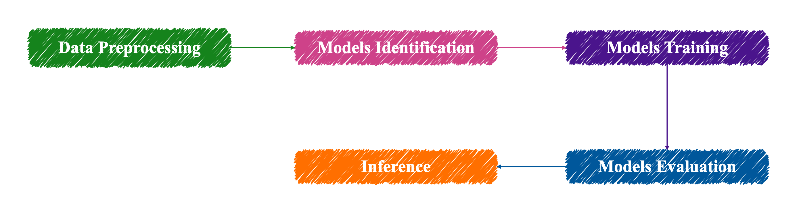
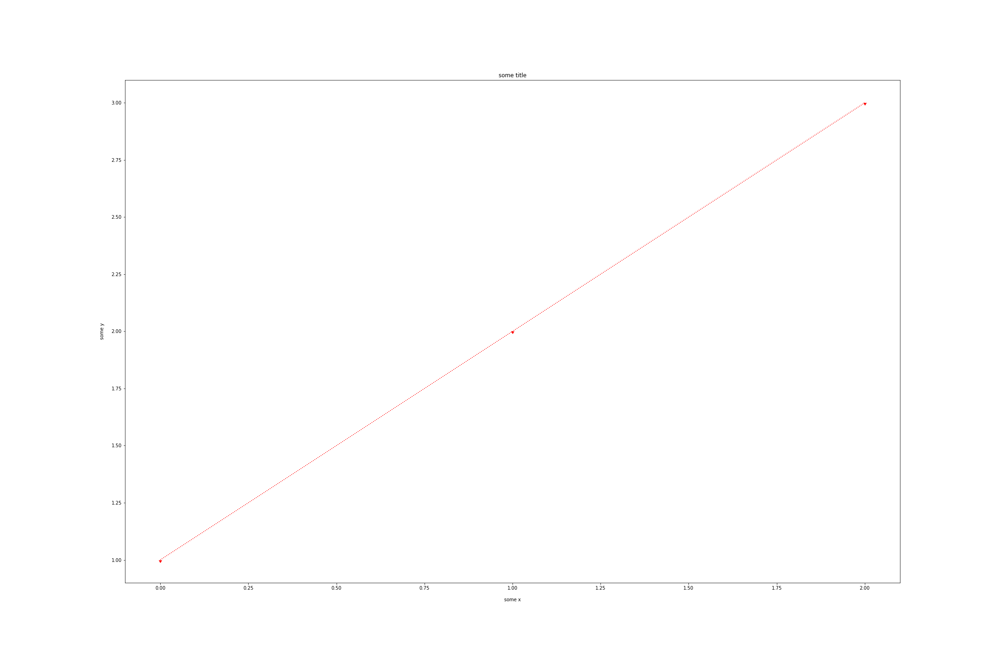

# Application Project for Deep Learning

This folder contains selected coursework materials and class projects for the Application Project for Deep Learning course in the CGUIM master's program. The uploaded package focuses on reproducible notebooks, Python scripts, final-project figures, and compact reference materials.

> Note: Course presentation files and raw data files are intentionally excluded from the GitHub upload. Original filenames are preserved in the uploaded folders.

## Repository Structure

```text
Application Project for Deep Learning/
|-- README.md
|-- scripts/
|   |-- coursework/
|   |-- final_project/
|   `-- llm_project/
|-- reports/
|   `-- final_project/
`-- figures/
    |-- coursework/
    `-- final_project/
```

## Course Content

| Area | Uploaded files / folders | Description |
|---|---|---|
| Python and AI basics | `scripts/coursework/1.AI基礎訓練教材(Python相關操作及實務)/` | Introductory Python and pandas notebooks. CSV input files are excluded as raw data. |
| Data preprocessing | `scripts/coursework/2.AI基礎訓練教材(資料前置處理)/` | Data cleaning, concatenation, missing-value handling, and preprocessing practice notebooks. |
| Evaluation metrics and statistics | `scripts/coursework/3.AI基礎教材指標衡量方法/` | Metrics, ANOVA, Tukey post-hoc testing, regression, and clustering/classification practice notebooks. |
| Data visualization | `scripts/coursework/4.資料視覺化分析/` | Python visualization notebook using pandas, matplotlib, and seaborn. The source air-quality CSV is excluded. |
| LLM mini project | `scripts/llm_project/` | Streamlit + Ollama chatbot scripts, including a text-to-speech version using `gTTS`. |
| Final project | `scripts/final_project/`, `figures/final_project/`, `reports/final_project/` | EfficientNetB0 brain-tumor MRI image classification project. |

## LLM Project

| File | Main tools | Purpose |
|---|---|---|
| `scripts/llm_project/LLMProject.py` | Streamlit, Ollama, Mistral | Builds a simple local chatbot UI that accepts user text and returns an LLM response. |
| `scripts/llm_project/LLMProject_Text2Speech.py` | Streamlit, Ollama, Mistral, gTTS | Extends the chatbot with language selection and text-to-speech audio playback. |

## Final Project: Brain Tumor MRI Classification

The final project applies transfer learning with EfficientNetB0 to classify brain MRI images into four classes:

| Label | Meaning |
|---|---|
| `glioma_tumor` | Glioma tumor MRI images. |
| `meningioma_tumor` | Meningioma tumor MRI images. |
| `no_tumor` | MRI images without tumor. |
| `pituitary_tumor` | Pituitary tumor MRI images. |

### Project Files

| Type | File | Purpose |
|---|---|---|
| Notebook | `scripts/final_project/M1244017_高定儀_EfficientNet_BrainTumors_revised_revised.ipynb` | Main final-project notebook for loading MRI images, preprocessing, EfficientNetB0 training, evaluation, and inference. |
| Figure | `figures/final_project/Flow of the project.png` | Visual workflow of preprocessing, model identification, model training, evaluation, and inference. |
| Reference | `reports/final_project/1905.11946v5.pdf` | EfficientNet reference paper used for the model architecture background. |

### Dataset Summary

The original MRI image folders are not uploaded. The notebook was built around the Kaggle/GitHub Brain Tumor Classification MRI dataset and a locally combined train/test folder.

| Source folder | Class | Train images | Test images |
|---|---|---:|---:|
| `Brain Tumor Classification (MRI)_Combined` | `glioma_tumor` | 740 | 186 |
| `Brain Tumor Classification (MRI)_Combined` | `meningioma_tumor` | 749 | 188 |
| `Brain Tumor Classification (MRI)_Combined` | `no_tumor` | 400 | 100 |
| `Brain Tumor Classification (MRI)_Combined` | `pituitary_tumor` | 720 | 181 |
| **Total before split in notebook** |  | **2,609** | **655** |

After loading the combined folder, the notebook shuffles all images and applies an 80/20 train-test split:

| Split | Shape |
|---|---|
| Training images | `(2611, 224, 224, 3)` |
| Test images | `(653, 224, 224, 3)` |
| Training labels | `(2611, 4)` |
| Test labels | `(653, 4)` |

### Modeling Workflow

1. Load MRI images from four class folders.
2. Resize images to `224 x 224`.
3. Shuffle labels and images with a fixed random seed.
4. Split the combined dataset into training and test sets.
5. Convert labels to one-hot encoded vectors.
6. Use EfficientNetB0 pretrained on ImageNet with the top layers removed.
7. Add global average pooling, dropout, and a 4-class softmax output layer.
8. Compile with Adam, categorical cross-entropy, and accuracy.
9. Train for 10 epochs with validation split, TensorBoard, checkpointing, and learning-rate reduction.
10. Evaluate on training and test sets, then run single-image inference.

### Model Performance

| Metric | Value |
|---|---:|
| Training accuracy | 0.95 |
| Test accuracy | 0.91 |
| Test support | 653 images |
| Macro average F1-score | 0.91 |
| Weighted average F1-score | 0.91 |

| Class index | Label | Precision | Recall | F1-score | Support |
|---:|---|---:|---:|---:|---:|
| 0 | `glioma_tumor` | 0.93 | 0.88 | 0.91 | 187 |
| 1 | `meningioma_tumor` | 0.82 | 0.91 | 0.86 | 181 |
| 2 | `no_tumor` | 0.96 | 0.91 | 0.93 | 101 |
| 3 | `pituitary_tumor` | 0.96 | 0.93 | 0.95 | 184 |

## Figures

### Final Project Workflow



### Coursework Visualization Output



## Files Excluded from GitHub Upload

| Excluded item | Reason |
|---|---|
| `*.ppt`, `*.pptx` | Course presentation files are not uploaded. |
| Raw image folders under `Final Project/Deep Learning Project/Source Data/` | MRI datasets are raw data and too large for GitHub upload. |
| `*.csv`, `*.xlsx`, `*.xls` | Course exercise and source data files are treated as raw data and excluded. |
| `*.h5`, `*.keras` | Trained model files can be large and are generated outputs. |
| `.ipynb_checkpoints/`, `.DS_Store`, `__pycache__/` | Local metadata/cache files. |
| Original `AI/`, `Final Project/`, and `LLMProject/` folders | Source working folders remain local; selected copies are organized under `scripts/`, `reports/`, and `figures/`. |

## Upload Steps

Run the following commands from the repository root:

```bash
cd /Users/kao900531/Documents/GitHub/CGUIM_Master
git status
git add "Application Project for Deep Learning/README.md" "Application Project for Deep Learning/.gitignore" "Application Project for Deep Learning/scripts" "Application Project for Deep Learning/reports" "Application Project for Deep Learning/figures"
git status
git commit -m "Add Application Project for Deep Learning coursework and projects"
git push origin main
```

Before committing, check `git status` carefully and confirm that no presentation files (`.ppt` / `.pptx`) or raw data files (`.csv`, `.xlsx`, MRI source image folders, model checkpoints) are staged.
