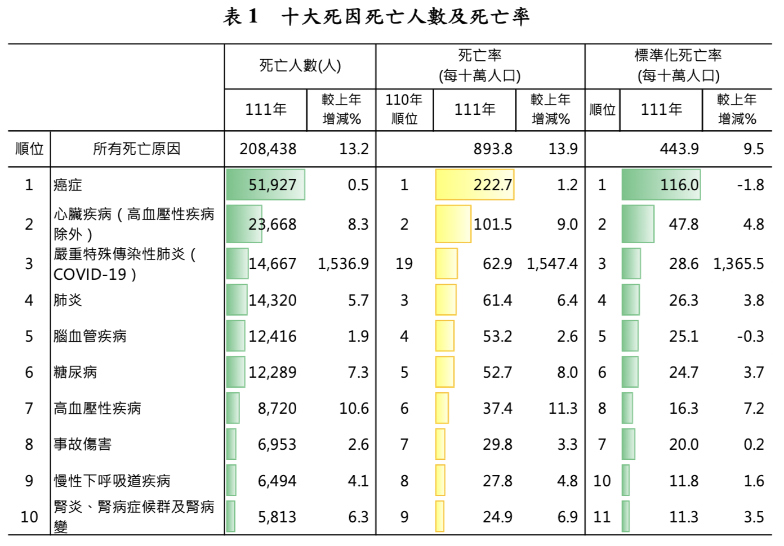
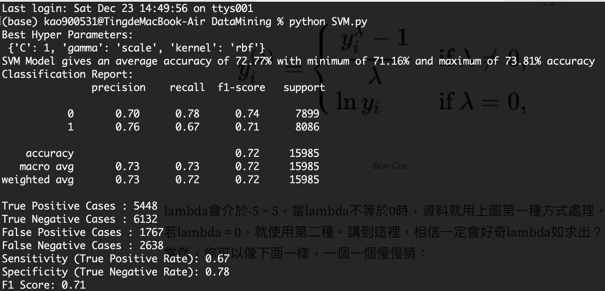
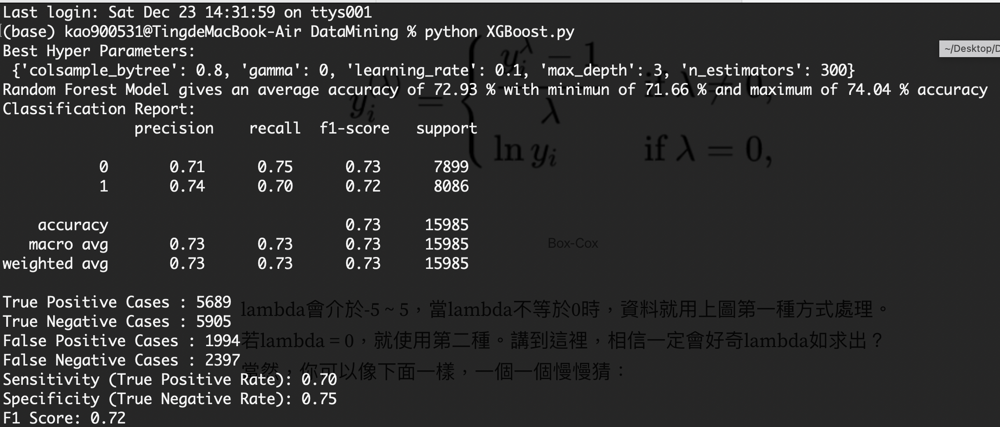

# Data Mining

This folder contains selected coursework materials and the final project for the Data Mining course in the CGUIM master's program. The final project applies data preprocessing, feature selection, and classification models to a cardiovascular disease dataset.

> Note: Course lecture slides are intentionally excluded from the GitHub upload because the files are large. Original filenames are preserved in the uploaded folders.

## Repository Structure

```text
Data Mining/
|-- README.md
|-- scripts/
|   |-- final_project/
|   |-- python_visualization/
|   `-- weka_examples/
|-- data/
|   |-- final_project/
|   |-- python_visualization/
|   `-- weka_examples/
|-- reports/
|   `-- final_project/
`-- figures/
    `-- final_project/
```

## Course Content

| Area | Files / folders | Description |
|---|---|---|
| Python visualization | `scripts/python_visualization/PythonVisualize.py`, `scripts/python_visualization/PythonVisualize.ipynb` | Iris dataset visualization practice, including distribution plots, scatter plots, regression plots, pair plots, bar charts, box plots, and pie charts. |
| Neural network examples | `scripts/python_visualization/example1/`, `scripts/python_visualization/example2/`, `scripts/python_visualization/example3/` | TensorFlow 2.x examples for Titanic, Boston Housing, and CIFAR/MNIST-style image classification practice. Large downloaded datasets are excluded from upload. |
| Weka examples | `scripts/weka_examples/`, `data/weka_examples/` | ARFF, CSV, Excel, and tab-delimited sample datasets used for Weka classification and association mining practice. |
| Final project | `scripts/final_project/`, `reports/final_project/`, `figures/final_project/` | Cardiovascular disease data preprocessing and classification project. |

## Final Project: Cardiovascular Disease Classification

The final project investigates risk factors related to cardiovascular disease (CVD) and builds classification models for early detection support. The project uses the public Kaggle cardiovascular disease dataset and compares k-NN, Random Forest, SVM, and XGBoost models.

### Project Files

| Type | File | Purpose |
|---|---|---|
| Notebook | `scripts/final_project/CardioProcessing.ipynb` | Data overview, outlier analysis, data conversion, BMI generation, feature selection, and model preparation. |
| Script | `scripts/final_project/SVM.py` | SVM model training with `GridSearchCV`, cross-validation, classification report, and confusion matrix evaluation. |
| Script | `scripts/final_project/XGBoost.py` | XGBoost model training with `GridSearchCV`, cross-validation, classification report, and confusion matrix evaluation. |
| Script | `scripts/final_project/convert.py` | Converts the target label in the cardiovascular dataset into readable CVD categories. |
| Data | `data/final_project/cardio_train.csv` | Raw cardiovascular disease dataset. |
| Data | `data/final_project/cleaned_data_yearsBMI_2.csv` | Cleaned dataset after outlier handling, age conversion, and BMI generation. |
| Data | `data/final_project/Cardio_processed_3.csv` | Final selected model input features. |
| Report | `reports/final_project/M1244017_高定儀_DMFinal.pdf` | Final presentation report. |
| Report | `reports/final_project/Analyzing Cardiovascular Diseases_Extra.pdf` | Detailed written final project report. |

### Dataset Overview

| Dataset | Rows | Columns | Notes |
|---|---:|---:|---|
| Raw cardiovascular dataset, `data/final_project/cardio_train.csv` | 70,000 | 13 | Contains patient ID, objective features, examination features, subjective features, and the binary `cardio` target. No missing values were found. |
| Cleaned dataset, `data/final_project/cleaned_data_yearsBMI_2.csv` | 63,938 | 13 | Removes unreasonable outliers, converts age from days to years, applies log adjustment to height and weight, and adds BMI. |
| Model input dataset, `data/final_project/Cardio_processed_3.csv` | 63,938 | 5 | Keeps the final selected model inputs: `age`, `ap_hi`, `ap_lo`, and `cholesterol`. |

### Feature Description

| Feature | Type | Description |
|---|---|---|
| `age` | Objective | Age. The raw dataset stores age in days; the processed dataset converts it to years. |
| `height` | Objective | Height in centimeters in the raw data; log-adjusted during preprocessing. |
| `weight` | Objective | Weight in kilograms in the raw data; log-adjusted during preprocessing. |
| `gender` | Objective | Categorical code: 1 = women, 2 = men. |
| `ap_hi` | Examination | Systolic blood pressure. |
| `ap_lo` | Examination | Diastolic blood pressure. |
| `cholesterol` | Examination | 1 = normal, 2 = above normal, 3 = well above normal. |
| `gluc` | Examination | 1 = normal, 2 = above normal, 3 = well above normal. |
| `smoke` | Subjective | Binary smoking indicator. |
| `alco` | Subjective | Binary alcohol intake indicator. |
| `active` | Subjective | Binary physical activity indicator. |
| `cardio` | Target | Binary cardiovascular disease indicator. |
| `bmi` | Derived | Body mass index generated during preprocessing. |

### Data Mining Workflow

1. Inspect the raw cardiovascular dataset and confirm that all 70,000 records have valid values.
2. Remove the non-informative `id` field.
3. Analyze outliers in `age`, `height`, `weight`, `ap_hi`, and `ap_lo`.
4. Apply log adjustment to `height` and `weight`, and remove unrealistic blood pressure values.
5. Convert age from days to years and generate BMI.
6. Use a correlation heatmap to select the final input features: `age`, `ap_hi`, `ap_lo`, and `cholesterol`.
7. Standardize input variables with `StandardScaler`.
8. Split the dataset into 75% training data and 25% testing data.
9. Train and evaluate k-NN, Random Forest, SVM, and XGBoost classifiers with 10-fold cross-validation.

### Model Comparison

| Metric | k-NN | Random Forest | SVM | XGBoost |
|---|---:|---:|---:|---:|
| True Positive | 5,583 | 5,569 | 5,448 | 5,689 |
| True Negative | 6,008 | 6,025 | 6,132 | 5,905 |
| False Positive | 1,891 | 1,874 | 1,767 | 1,994 |
| False Negative | 2,503 | 2,517 | 2,638 | 2,397 |
| Average Accuracy | 0.7257 | 0.7278 | 0.7277 | **0.7293** |
| Sensitivity | 0.6905 | 0.6887 | 0.6738 | **0.7036** |
| Specificity | 0.7606 | 0.7628 | **0.7763** | 0.7476 |
| Precision | 0.7460 | 0.7482 | **0.7550** | 0.7405 |
| F1 Score | 0.71711 | 0.71721 | 0.71209 | **0.72157** |

XGBoost performs best in average accuracy, sensitivity, and F1 score. Since sensitivity is especially important in medical diagnosis, XGBoost is selected as the most suitable final model in this project.

### Figures

#### Cardiovascular Disease Motivation



#### SVM Result



#### XGBoost Result



## Key Findings

| Finding | Explanation |
|---|---|
| Important factors | `age`, `ap_hi`, `ap_lo`, and `cholesterol` show comparatively stronger positive correlations with CVD than the other attributes in this project. |
| BMI result | BMI was generated during preprocessing, but its correlation with the target was lower than expected. |
| Best model | XGBoost had the best sensitivity and F1 score, making it the preferred model for the final project. |
| Practical value | The model workflow can support early CVD risk detection and help physicians or patients interpret related risk factors. |

## Files Excluded from GitHub Upload

The following files are intentionally not included in the upload commands:

| Excluded item | Reason |
|---|---|
| `*.ppt`, `*.pptx` | Course presentation files are large and should not be uploaded. |
| `*.spv` | SPSS viewer files are not directly previewable in GitHub README. |
| `Python/Neural Networks/example3/datasets/` | Downloaded CIFAR data is very large and should not be committed. |
| `Python/Neural Networks/example3/cifar10.h5` | Large generated model/data file. |

## Upload Steps

Run the following commands from the repository root:

```bash
cd /Users/kao900531/Documents/GitHub/CGUIM_Master
git status
git add "Data Mining/README.md" "Data Mining/.gitignore" "Data Mining/scripts" "Data Mining/data" "Data Mining/reports" "Data Mining/figures"
git status
git commit -m "Add Data Mining coursework and final project"
git push origin main
```

Before committing, check `git status` carefully and confirm that no lecture slides (`.ppt` / `.pptx`) are staged.
