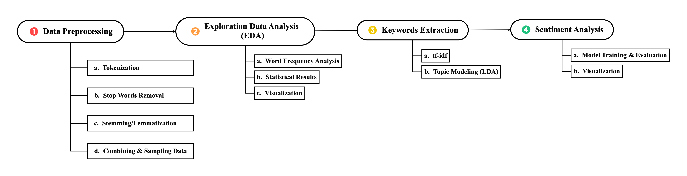
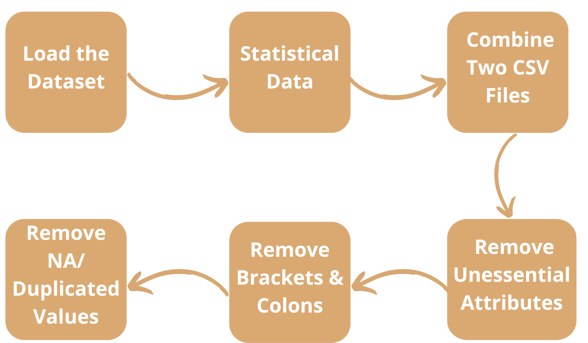
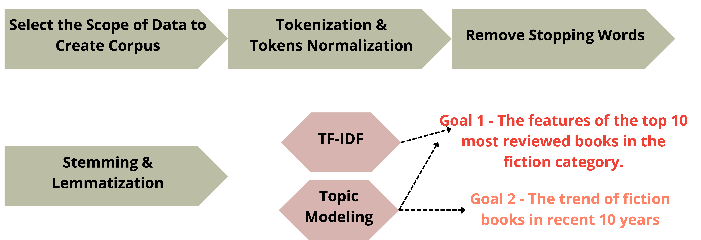

# Web Mining and Text Mining

This folder contains selected coursework materials and the final project for the Web Mining and Text Mining course in the CGUIM master's program. The final project analyzes Amazon book reviews with text preprocessing, exploratory data analysis, TF-IDF keyword extraction, LDA topic modeling, and VADER sentiment analysis.

> Note: Course presentation files and raw data files are intentionally excluded from the GitHub upload because the files are large. Original filenames are preserved in the uploaded folders.

## Repository Structure

```text
Web Mining and Text Mining/
|-- README.md
|-- scripts/
|   |-- final_project/
|   `-- assignments/
|-- reports/
|   |-- final_project/
|   `-- assignments/
`-- figures/
    `-- final_project/
```

## Course Content

| Area | Uploaded files / folders | Description |
|---|---|---|
| Final project notebooks | `scripts/final_project/` | Python notebooks for Amazon Books Reviews preprocessing, EDA, keyword extraction, topic modeling, and sentiment analysis. |
| Course assignment notebook | `scripts/assignments/demo.ipynb` | Week 7 text mining practice notebook covering bag-of-words and TF-IDF examples. |
| Final project report | `reports/final_project/M1244017_M1244022_TextMining_FinalProject.pdf` | Final written report for the text mining project. |
| Project proposal | `reports/final_project/Text Mining Final Project Proposal.pdf` | Proposal document that defines the project problem, data preprocessing plan, and expected methods. |
| Related assignment reports | `reports/assignments/` | Selected PDF assignment reports. Presentation slide files are not included. |
| Project figures | `figures/final_project/` | Process-flow figures used to explain the final project workflow. |

## Final Project: Decoding Books Reviews

The final project is titled **Decoding Books Reviews: Analyzing Features of Popular Books, A Specific Genre of Books, and Reader Sentiment**. It uses the Kaggle Amazon Books Reviews dataset to study reader behavior and book reception.

### Research Questions

| Question | Focus | Methods |
|---|---|---|
| Q1 | What are the features of popular books? | EDA, TF-IDF, word clouds, and LDA on popular fiction reviews. |
| Q2 | What kinds of books are categorized as `Books`, and can they be classified into a more meaningful genre? | LDA topic modeling on reviews from the ambiguous `Books` category. |
| Q3 | What are customers complaining about in reviews? | TF-IDF, word cloud, and VADER sentiment analysis on low-score reviews. |

### Source Dataset Summary

The raw dataset is not uploaded to GitHub. The project originally used these Kaggle files:

| Raw file | Records / rows | Columns | Size observed locally | Upload status |
|---|---:|---:|---:|---|
| `books_data.csv` | 212,404 books | 10 | ~173 MB | Excluded |
| `Books_rating.csv` | 3,000,000 reviews | 10 | ~2.7 GB | Excluded |
| `combined_dataset.csv` | 3,000,000 rows | 19 before selection | ~5.2 GB | Excluded |
| `processed_dataset.csv` | 2,091,935 rows | 7 | ~1.8 GB | Excluded |

### Final Analytical Dataset

After preprocessing, the project keeps only the attributes needed for analysis:

| Attribute | Description |
|---|---|
| `Title` | Book title used to merge metadata and review records. |
| `authors` | Author names after removing brackets and colons. |
| `publishedDate` | Publication date standardized by keeping the year. |
| `categories` | Book category / genre labels. |
| `review/score` | Amazon review score. |
| `review/summary` | Short review summary. |
| `review/text` | Full review text used for text mining. |

### Workflow

1. Load `books_data.csv` and `Books_rating.csv`.
2. Combine the two CSV files by `Title`.
3. Remove unessential attributes and keep seven analytical fields.
4. Clean `authors`, `categories`, and `publishedDate`.
5. Remove missing and duplicated values.
6. Conduct EDA on categories, review counts, authors, and publication years.
7. Build corpora for popular fiction books and the ambiguous `Books` category.
8. Apply tokenization, normalization, stopword removal, stemming, and lemmatization.
9. Use TF-IDF and word clouds for keyword extraction.
10. Use LDA and coherence scores for topic modeling.
11. Use VADER sentiment analysis to inspect reader complaints.

## Figures

### Overall Analysis Flow



### Data Preprocessing Flow



### Keyword Extraction Flow



## Results Summary

| Topic | Result |
|---|---|
| Popular categories | Fiction appears as the dominant category in the processed dataset. |
| Popular fiction books | Harry Potter and The Hobbit appear among the most reviewed fiction titles. |
| Highly rated fiction authors | J. R. R. Tolkien, J. K. Rowling, and Rey Terciero appear among the top authors with 5-star fiction reviews in the report. |
| Corpus 1 topic modeling | The selected LDA model uses 5 topics; key themes include character development, Harry Potter, The Hobbit, The Giver, and The Catcher in the Rye. |
| Corpus 2 topic modeling | The selected LDA model uses 12 topics for recent high-rated fiction reviews; themes include existential topics, classic literature, romance/social themes, war, children's literature, religion, mystery, and adventure. |
| `Books` category analysis | The ambiguous `Books` category is interpreted as containing themes related to politics, biography, and non-fiction. |
| Complaint analysis | For *The Death of Outrage: Bill Clinton and the Assault on American Ideals*, low-score complaints center on political and moral arguments. |
| Sentiment analysis limitation | VADER had difficulty capturing sarcasm, negation, and multipolarity in politically charged reviews. |

## Uploaded Files

| Folder | Files |
|---|---|
| `scripts/final_project/` | `TextMining_FinalProject_Local.ipynb`, `TextMining_FinalProject_colab.ipynb`, `3-books-lda-test.ipynb`, `4-books-sentiment-analysis.ipynb` |
| `scripts/assignments/` | `demo.ipynb` |
| `reports/final_project/` | `M1244017_M1244022_TextMining_FinalProject.pdf`, `Text Mining Final Project Proposal.pdf` |
| `reports/assignments/` | `Building a Technology Recommender System Using Web Crawling and Natural Language Processing Technology.pdf`, `Research trends in text mining Semantic network and main path analysis of selected journals.pdf` |
| `figures/final_project/` | `Data Process Flow.png`, `Data Preprocessing.png`, `KeywordExtraction_q1.png` |

## Files Excluded from GitHub Upload

| Excluded item | Reason |
|---|---|
| `*.ppt`, `*.pptx` | Course presentation files are large and should not be uploaded. |
| Raw and processed CSV data | Raw review files and processed datasets range from hundreds of MB to several GB. |
| `Assignments/` | Original assignment working folders contain raw datasets, slide decks, DOCX drafts, and duplicate project files; selected outputs are copied into `scripts/`, `reports/`, and `figures/`. |
| `Assignments/Final Project/Source Data/` | Contains source and processed data files, including `Books_rating.csv`, `books_data.csv`, `combined_dataset.csv`, and `processed_dataset.csv`. |
| `Assignments/TextMiningProcessing/Data/` | Duplicate raw dataset folder. |
| `Assignments/Week 7/TextMiningProject1/Data/` | Duplicate raw / preprocessed dataset folder. |
| `CSR/` | Large CSR text corpus not part of the selected upload package. |
| `Lecture/`, `Textbooks/`, `Midterm/` | Lecture slides, textbook PDFs, and exam review materials are not included in the GitHub upload package. |
| `.DS_Store` | macOS metadata file, not project content. |

## Upload Steps

Run the following commands from the repository root:

```bash
cd /Users/kao900531/Documents/GitHub/CGUIM_Master
git status
git add "Web Mining and Text Mining/README.md" "Web Mining and Text Mining/.gitignore" "Web Mining and Text Mining/scripts" "Web Mining and Text Mining/reports" "Web Mining and Text Mining/figures"
git status
git commit -m "Add Web Mining and Text Mining coursework and final project"
git push origin main
```

Before committing, check `git status` carefully and confirm that no presentation files (`.ppt` / `.pptx`) or raw data files (`.csv`, source data folders, CSR corpus folders) are staged.
